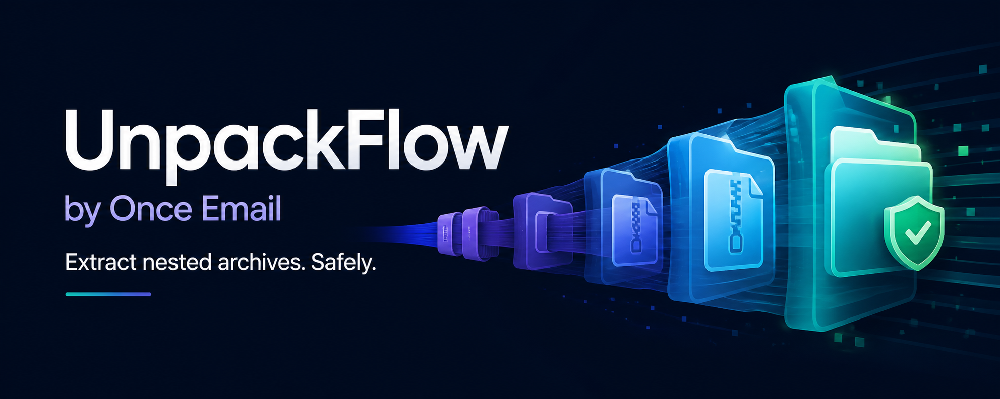

<p align="center"><a href="https://once-email.com"></a></p>

# UnpackFlow — فك الأرشيفات المتداخلة بلا مراقبة

[English](../README.md) · [简体中文](README.zh-CN.md) · [Español](README.es.md) · [हिन्दी](README.hi.md) · [العربية](README.ar.md) · [Português](README.pt-BR.md) · [Français](README.fr.md) · [Deutsch](README.de.md) · [日本語](README.ja.md) · [Русский](README.ru.md)

عند استخدام `-r` ووجود اسم الإخراج مسبقاً، يضيف UnpackFlow اسم مجلد المصدر مثل `sample-backup-legacy-set-unpacked`، ثم `-2` و`-3` للتعارضات اللاحقة، من دون استبدال النتائج أو تخطيها.

تغطي الحزمة الصغيرة `unpack-flow-minimal-testcases-v1.zip` ملفات ZIP وTAR.GZ وUnicode والأرشيفات المتداخلة و`part01.exe` متعدد الأجزاء وفشل الجزء المفقود المتوقع، بلا تطبيقات كبيرة ومن دون تشغيل SFX.

يستخدم اختبار القبول الأصلي بيانات اصطناعية في `/data/unpack-flow-testcases`، ويمكن تغيير المسار عبر `UNPACK_FLOW_TEST_ROOT`. الحزم الكبيرة اختيارية ومخصصة للأداء أو توافق الصيغ الإضافي.

يعالج UnpackFlow توزيعات البرامج ومجموعات البيانات والنسخ الاحتياطية وملفات الوسائط وغيرها من الأرشيفات الكبيرة. يكتشف الجزء الأول ويفك الطبقات المتداخلة بالتتابع ويعرض الحزمة والمرحلة والطبقة والوقت.

## الاستخدام والتثبيت

الأوامر: `unpack-flow list 'Archive*'` و`plan` و`unpack-flow 'Archive*'` و`status`. يحتاج Linux إلى Bash، وWindows إلى PowerShell و7-Zip، وmacOS إلى PowerShell 7+ و`7zz`. يبني `scripts/build-release.sh` الحزم الثلاث وSHA-256.

لا يلزم Python لتشغيل `unpack-flow` أو استخراج الأرشيفات. يلزم Python 3 فقط لتثبيت Skill تلقائياً على Linux/macOS بواسطة `install_local.py` أو `install_local.sh` ولتشغيل تدقيق Python. يستخدم Windows ملف `install_local.ps1` عبر PowerShell فقط، كما أن النسخ اليدوي للـSkill لا يحتاج إلى Python.

## سيناريوهات الاستخراج المدعومة

يفك UnpackFlow المجلدات والأنماط على دفعات، ويفتح الأرشيفات المتداخلة طبقة بعد طبقة، ويحدد الجزء الأول من مجموعات RAR متعددة الأجزاء. كما يفحص حزم RAR ذاتية الاستخراج من دون تشغيل ملفات EXE مجهولة. يناسب حزم البرامج والبيانات والنسخ الاحتياطية والوسائط والسجلات وصور ISO أو WIM.

يعالج افتراضياً حتى 10 طبقات داخلية. يحتفظ بالأرشيف الداخلي التالف أو الناقص ويسجل فشله ويتجاوزه لمتابعة بقية الأرشيفات؛ استخدم `-StopOnError` للتوقف عند أول خطأ.

## أمثلة للتعلم

استخدم `list` و`plan` و`start` و`status` و`log` و`wait` للنسخ الاحتياطية والبيانات والسجلات والبرامج والأرشيفات متعددة الأجزاء. الألعاب مجرد مثال وليست حدود المنتج.

على الأنظمة الثلاثة يعمل `run` في الواجهة مع عرض التقدم، بينما يبدأ `start` مهمة خلفية ويعيد معرّفها.

أثناء عمليات 7-Zip أو UnRAR الطويلة يُحدّث الوقت كل ثانية وتُسجّل إشارة نشاط كل 30 ثانية.

على macOS وWindows يفصل `start` كل تدفقات الطرفية التفاعلية؛ يُكتب التقدم في السجل فقط بلا رموز ANSI أو أصوات تنبيه.

استخدم `-r` أو `-Recursive` لاكتشاف كل الأرشيفات داخل المجلدات الفرعية وفك طبقاتها الداخلية؛ وعند تعارض الاسم تُحفظ النتيجة بأمان باسم `name-unpacked`.

يدعم البرنامج أيضاً `unpack-flow run *`. بعد توسيع `*` بواسطة الصدفة، يحتفظ الفحص بالأرشيفات المفردة والأجزاء الأولى مثل `part1.exe` و`part1.rar` و`.7z.001` و`.zip.001`، ويستبعد `.sha256` والملفات غير المتعلقة والأجزاء اللاحقة.

يعرض `unpack-flow help` مرجع الأوامر الموحّد بالإنجليزية والصينية المبسطة.

## المهام الخلفية والسجلات

يشغّل `unpack-flow start "الأرشيف" -Output "الوجهة"` الاستخراج في الخلفية ويعيد معرّف مهمة. استخدم `unpack-flow status [id]` و`unpack-flow log [id]` و`unpack-flow wait [id]`؛ وعند حذف المعرّف تُستخدم أحدث مهمة. توجد السجلات في `%LOCALAPPDATA%\unpack-flow\state` على Windows وفي `~/.local/state/unpack-flow` على macOS/Linux.

تُدعم صيغ TAR وTAR.GZ/TGZ وGZ المستقلة. بعد 7-Zip يجرّب البرنامج بحسب الصيغة UnRAR أو `tar` أو GZip أو ZIP الأصلي، وينظف كل محاولة فاشلة؛ وعند نفاد الأدوات يحتفظ بالأرشيف ويسجل الفشل ويتابع التالي من دون إعادة لا نهائية.

تتضمن حزمة Linux x64 برنامج UnRAR 7.23 الرسمي. وتتضمن حزم Windows x64/ARM64 النسخة الرسمية الكاملة من 7-Zip 26.02، كما تتضمن x64 برنامج UnRAR؛ وتُحفظ الحزم والتراخيص الأصلية.

## بدء سريع كامل

```bash
unpack-flow list '/data/archives/*'
unpack-flow plan '/data/archives/backup.part1.rar'
unpack-flow run '/data/archives/*' -Output '/data/extracted'
```

للتشغيل في الخلفية:

```bash
unpack-flow start '/data/archives/*' -Output '/data/extracted'
unpack-flow status
unpack-flow log
unpack-flow wait
```

يبقى `run` في الطرفية الحالية، بينما يعيد `start` معرّف المهمة فوراً. يحتفظ الوضعان بالأرشيفات الأصلية.

## تثبيت أداة سطر الأوامر

### Linux

```bash
./install-linux.sh --check
./install-linux.sh
unpack-flow version
```

### macOS

```bash
./install-macos.sh --check
./install-macos.sh
unpack-flow version
```

### Windows

```bat
install.bat -Check
install.bat
unpack-flow version
```

تعرض أوامر الفحص التبعيات المفقودة، لكنها لا تثبت برامج النظام تلقائياً.

## التكرار والسجلات والفشل

استخدم `-r` أو `-Recursive` لفحص المجلدات الفرعية وفك الطبقات الداخلية. الحد الافتراضي هو 10 طبقات داخلية.

| المنصة | مجلد الحالة الافتراضي |
|---|---|
| Windows | `%LOCALAPPDATA%\unpack-flow\state` |
| Linux/macOS | `${XDG_STATE_HOME:-$HOME/.local/state}/unpack-flow` |

يستخدم UnpackFlow سلسلة محدودة: 7-Zip، ثم UnRAR لملفات RAR، ثم أدوات النظام المناسبة لـ TAR أو GZ أو ZIP. ينظف ناتج كل محاولة غير مكتملة. إذا فشلت جميع الخيارات، يحتفظ بالأرشيف ويسجل الخطأ ويتابع التالي. استخدم `-StopOnError` فقط للتوقف عند أول خطأ.

## الاختبارات وتثبيت Agent Skill

```bash
bash tests/generate-minimal-public-suite.sh
bash tests/test-minimal-public-suite.sh
pwsh -NoProfile -File tests/test-minimal-public-suite.ps1
scripts/install_local.sh .
```

على Windows ثبّت Skill بواسطة `scripts/install_local.ps1`. لا يحتاج فك الأرشيفات إلى Python؛ يُستخدم Python فقط لمثبت Skill الآلي على Linux/macOS وللتدقيق المكتوب بـ Python.

## الأمان والمشروع والدعم

يحافظ UnpackFlow على الملفات المصدر، ولا يستبدل مجلدات الوجهة، ولا يشغّل ملفات EXE مجهولة.

- الموقع الرسمي: [once-email.com](https://once-email.com)
- المنشئة والمطوّرة: helen.jar
- مشروع GitHub: [pangxin12345/unpack-flow](https://github.com/pangxin12345/unpack-flow)
- بريد الدعم: [tiantuowl@gmail.com](mailto:tiantuowl@gmail.com)

لأي سؤال، راسل [tiantuowl@gmail.com](mailto:tiantuowl@gmail.com) أو [افتح مشكلة على GitHub](https://github.com/pangxin12345/unpack-flow/issues).

ترخيص MIT، الإصدار 2.1.4.
